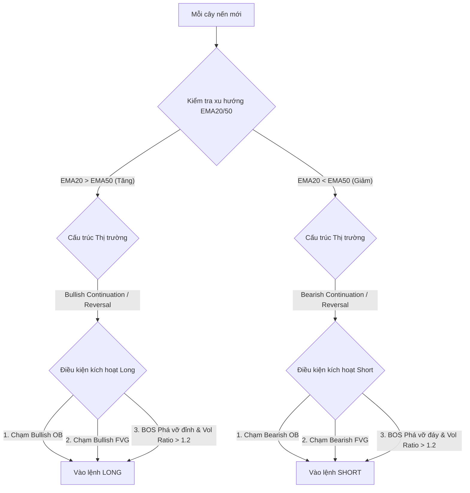

# Logic Baseline - Rule-Based Trading Bot (Tài liệu Kỹ thuật Chi tiết)

Tài liệu này trình bày chi tiết về kiến trúc hoạt động, giải thuật nhận diện kỹ thuật (SMC, Wyckoff, Price Action), quy tắc vào/thoát lệnh lướt sóng (Scalping), và quy trình mô phỏng kiểm thử của Baseline Bot ([run_baseline.py](file:///D:/NCKH/LLM_trading_ScienceResearch/scripts/run_baseline.py)).

---

## 1. Kiến trúc Tổng quan & Vai trò Hệ thống

Baseline Bot là một bot giao dịch **hoàn toàn theo quy tắc (Rule-Based, Deterministic)**. Thay vì sử dụng trí tuệ nhân tạo (LLM) để phân tích đồ thị như trong [LogicAI.md](file:///D:/NCKH/LLM_trading_ScienceResearch/LogicAI.md), bot này sử dụng các điều kiện logic toán học cứng được lập trình bằng Python.

### Vai trò của Baseline Bot:
1. **Mô hình đối chứng (Baseline Model):** Tạo ra kết quả giao dịch chuẩn mực dựa trên phân tích kỹ thuật truyền thống để so sánh với hiệu năng của AI Bot dưới cùng điều kiện thị trường, phí giao dịch, và trượt giá.
2. **Tối ưu hóa hiệu năng:** Chạy hoàn toàn cục bộ, không tốn chi phí gọi API LLM và tốc độ thực thi backtest cực nhanh.
3. **Mô phỏng đồng bộ:** Tái sử dụng 100% cơ sở hạ tầng của [backtest.py](file:///D:/NCKH/LLM_trading_ScienceResearch/backtest.py) (bao gồm mô hình khớp lệnh trong nến, tính phí taker/maker, quản lý số dư và tính toán Sharpe/Sortino).

---

## 2. Giải thuật Nhận diện Cấu trúc Thị trường & Mẫu hình

Baseline Bot mã hóa các khái niệm của phương pháp **Smart Money Concepts (SMC)**, **Wyckoff**, và **Price Action** thành code Python thông qua 4 hàm cốt lõi dưới đây:

### A. Nhận diện Mẫu nến Price Action (`detect_candlestick_patterns`)
Hàm quét 2 cây nến gần nhất để phát hiện các tín hiệu đảo chiều/tiếp diễn trực quan:
* **Pinbar (Hammer / Shooting Star):** Thân nến nhỏ ($\le 35\%$ tổng chiều dài nến), có bóng nến trên hoặc dưới rất dài ($\ge 60\%$ tổng chiều dài nến).
  - *Bullish Pinbar:* Bóng nến dưới dài (áp lực mua mạnh).
  - *Bearish Pinbar:* Bóng nến trên dài (áp lực bán mạnh).
* **Engulfing (Nến nhấn chìm):** Nến hiện tại có thân lớn phủ hoàn toàn thân của nến trước đó và đi ngược hướng.
* **Inside Bar:** Cây nến hiện tại có toàn bộ khoảng giá High-Low nằm trọn trong khoảng giá High-Low của cây nến trước đó (tín hiệu nén giá chờ bứt phá).

### B. Phát hiện Khoảng trống Giá FVG (`detect_fvgs`)
**Fair Value Gap (FVG)** thể hiện sự mất cân bằng giữa cung và cầu được tạo ra bởi một xung lực mạnh.
* **Bullish FVG (Khoảng trống tăng giá):** Xuất hiện khi Low của nến thứ 3 cao hơn High của nến thứ 1. Khoảng trống được tính từ $\text{High}_{t-2}$ đến $\text{Low}_{t}$.
* **Bearish FVG (Khoảng trống giảm giá):** Xuất hiện khi High của nến thứ 3 thấp hơn Low của nến thứ 1. Khoảng trống được tính từ $\text{High}_{t}$ đến $\text{Low}_{t-2}$.
* **Cơ chế Mitigation (Lấp FVG):** Một FVG được coi là còn hoạt động (unmitigated) nếu giá đóng cửa các nến sau chưa từng quay đầu lấp hoàn toàn khoảng trống này.

### C. Nhận diện Khối lệnh Tổ chức OB (`detect_order_blocks`)
**Order Block (OB)** là cây nến giảm cuối cùng trước một đợt tăng mạnh (Bullish OB) hoặc cây nến tăng cuối cùng trước một đợt giảm mạnh (Bearish OB).
1. **Xác định xung lực (Displacement):** Một đợt di chuyển giá mạnh được xác định khi thân nến vượt quá $1.5 \times$ chiều dài trung bình của 20 nến trước đó.
2. **Xác định khối OB:**
   - *Bullish OB:* Cây nến giảm cuối cùng trước cây nến tăng mạnh. Ranh giới High-Low của cây nến này trở thành vùng Cầu (Demand Zone).
   - *Bearish OB:* Cây nến tăng cuối cùng trước cây nến giảm mạnh. Ranh giới High-Low của cây nến này trở thành vùng Cung (Supply Zone).
3. **Cơ chế Mitigation (Giảm thiểu):** OB bị vô hiệu khi giá đóng cửa nằm ngoài ranh giới của OB (bị phá vỡ).

### D. Xác định Cấu trúc Thị trường (`detect_market_structure`)
Thuật toán tìm kiếm các điểm đảo chiều Swing High và Swing Low trong 20 nến gần nhất:
* **Swing High:** Điểm cao nhất có 2 nến bên trái và 2 nến bên phải thấp hơn.
* **Swing Low:** Điểm thấp nhất có 2 nến bên trái và 2 nến bên phải cao hơn.

**Phát hiện BOS / CHoCH:**
* **BOS (Break of Structure - Phá vỡ cấu trúc):** Khi giá đóng cửa phá vỡ Swing High gần nhất (trong xu hướng tăng) hoặc Swing Low gần nhất (trong xu hướng giảm), xác nhận xu hướng tiếp diễn.
* **CHoCH (Change of Character - Thay đổi tính chất):** Khi giá đóng cửa phá vỡ Swing Point đối nghịch của xu hướng hiện tại, cảnh báo sự đảo chiều xu hướng chính.
* **Quét ngược lịch sử (Backward Scan):** Để giải quyết lỗi bỏ sót tín hiệu khi giá di chuyển trong các vùng giằng co (range), hàm quét ngược từ cây nến hiện tại về quá khứ để tìm điểm BOS/CHoCH gần nhất để xác định đúng xu hướng cấu trúc hiện tại (`Bullish/Bearish Continuation` hoặc `Reversal`).

---

## 3. Thuật toán Vào lệnh lướt sóng (Scalping Entry Logic)

Để tối ưu hóa cho chiến thuật **Scalping (Lướt sóng ngắn)**, các điều kiện xác nhận nến nghiêm ngặt đã được lược bỏ. Bot sẽ vào lệnh trực tiếp tại ranh giới vùng Cung/Cầu hoặc đuổi theo đà bứt phá.

### A. Quy tắc Long Entry (Mua)
* **Bộ lọc xu hướng (Trend Filter):** Đường EMA20 nằm trên EMA50 ($\text{EMA20} > \text{EMA50}$) **VÀ** cấu trúc thị trường đang ở trạng thái `Bullish Continuation` hoặc `Bullish Reversal`.
* **Yếu tố kích hoạt (Trigger) - Thỏa mãn 1 trong 3:**
  1. *OB Mitigation:* Giá hiện tại giảm về chạm vùng Bullish OB hoạt động ($\text{OB Low} \le \text{Price} \le \text{OB High}$).
  2. *FVG Mitigation:* Giá hiện tại giảm về chạm vùng Bullish FVG hoạt động ($\text{FVG Low} \le \text{Price} \le \text{FVG High}$).
  3. *BOS Breakout:* Giá phá vỡ đỉnh gần nhất (BOS Bullish) đồng thời có khối lượng giao dịch bùng nổ vượt trung bình ($\text{Volume Ratio} > 1.2$).

### B. Quy tắc Short Entry (Bán)
* **Bộ lọc xu hướng (Trend Filter):** Đường EMA20 nằm dưới EMA50 ($\text{EMA20} < \text{EMA50}$) **VÀ** cấu trúc thị trường ở trạng thái `Bearish Continuation` hoặc `Bearish Reversal`.
* **Yếu tố kích hoạt (Trigger) - Thỏa mãn 1 trong 3:**
  1. *OB Mitigation:* Giá hiện tại tăng về chạm vùng Bearish OB hoạt động.
  2. *FVG Mitigation:* Giá hiện tại tăng về chạm vùng Bearish FVG hoạt động.
  3. *BOS Breakout:* Giá phá vỡ đáy gần nhất (BOS Bearish) đồng thời có khối lượng giao dịch bùng nổ vượt trung bình ($\text{Volume Ratio} > 1.2$).

---

## 4. Quản lý Vị thế, Chốt lời & Dừng lỗ (TP/SL)

Do đặc thù của Scalping đòi hỏi tỷ lệ R:R tốt trên các biến động ngắn, bot thiết lập quản lý vị thế cực kỳ chặt chẽ:

### A. Dặt Dừng lỗ (Stop Loss) cực ngắn
Dừng lỗ được thiết lập tự động dựa trên loại lệnh kích hoạt:
* **Vào lệnh theo OB/FVG:** SL được đặt ngay tại biên an toàn dưới đáy của OB/FVG kích hoạt (đối với lệnh Long) hoặc trên đỉnh của OB/FVG kích hoạt (đối với lệnh Short), cộng/trừ một khoảng đệm nhỏ:
  $$\text{SL}_{\text{Long}} = \text{OB/FVG Low} - 0.05 \times \text{ATR}$$
  $$\text{SL}_{\text{Short}} = \text{OB/FVG High} + 0.05 \times \text{ATR}$$
* **Vào lệnh theo Breakout:** SL mặc định được đặt cách giá vào một khoảng $1.2 \times \text{ATR}$.

### B. Đặt Chốt lời (Take Profit) nhanh
* **TP Mặc định:** Đặt ở mức $2.0 \times \text{ATR}$ từ điểm vào lệnh để đảm bảo chốt lời nhanh trong các đợt sóng ngắn.
* **TP theo Swing Point:** Nếu phát hiện đỉnh/đáy Swing cũ của cấu trúc thị trường nằm trong phạm vi từ $1.2 \times \text{ATR}$ đến $3.0 \times \text{ATR}$ so với điểm vào, bot sẽ tự động đặt TP trùng khớp với các mốc này nhằm tận dụng dòng thanh khoản (Liquidity Sweep).

### C. Luật đảo chiều vị thế lập tức (Reversal Rule)
Nếu đang mở một vị thế (ví dụ: Long) nhưng xuất hiện tín hiệu kích hoạt chiều ngược lại (Short Entry Condition thỏa mãn):
1. Bot lập tức gửi lệnh đóng vị thế Long hiện tại với lý do: `"SMC Scalping Reversal opposite signal met"`.
2. Đồng thời mở ngay một vị thế Short mới tại nến đó để bám sát xu hướng dòng tiền lớn.

---

## 5. Quy trình Chạy & Giả lập Backtest

1. **Khởi tạo dữ liệu:** Đọc các tham số cấu hình từ file `.env` (Symbol, Start/End Date, Start Capital).
2. **Duyệt qua trục thời gian (Timeline Loop):**
   - Core Python mô phỏng từng bước giá đóng cửa qua từng ngày/nến.
   - Đầu mỗi nến, gọi `bot.check_stop_loss_take_profit()` để kiểm tra xem giá có chạm mức SL/TP cứng trong nến trước đó hay không để khớp lệnh đóng tự động.
3. **Đánh giá quy tắc:** Nếu không có vị thế mở, bot đánh giá các điều kiện Long/Short Entry để mở lệnh. Nếu có vị thế mở, kiểm tra điều kiện đảo chiều (Reversal).
4. **Kết thúc phiên:** Tự động tất toán toàn bộ vị thế còn mở ở cây nến cuối cùng, ghi dữ liệu kết quả ra tệp tin JSON và gửi thống kê chi tiết về Telegram.
